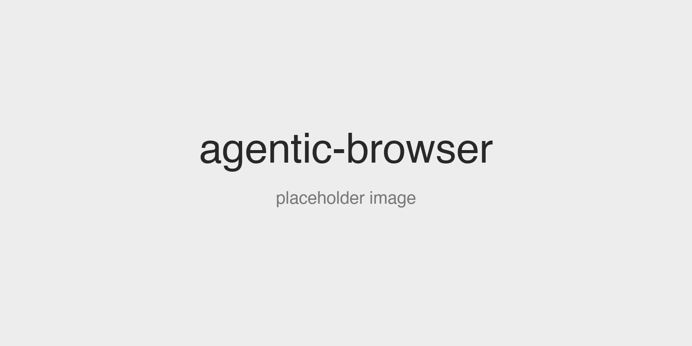

<strong>agentic-browser</strong> is an open-source browser built for AI agents to use.

  

 If you want the search engine built for AI agents, see <a href="https://github.com/Al3xWalton/agentic-search">agentic-search</a>.

---

## Quickstart

agentic-browser is not released yet. There is nothing to install or build today.
This section will hold the install and run commands for each platform once the
first build ships.

## Docs

Documentation arrives with the first build. Until then, see [NOTICE](NOTICE)
for how the project is licensed and what it is based on.

## License

MPL-2.0 for code written for this project. See [LICENSE](LICENSE) and [NOTICE](NOTICE).
